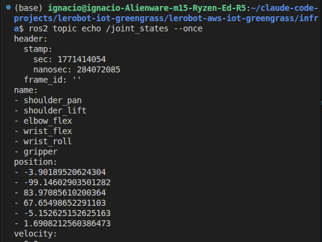
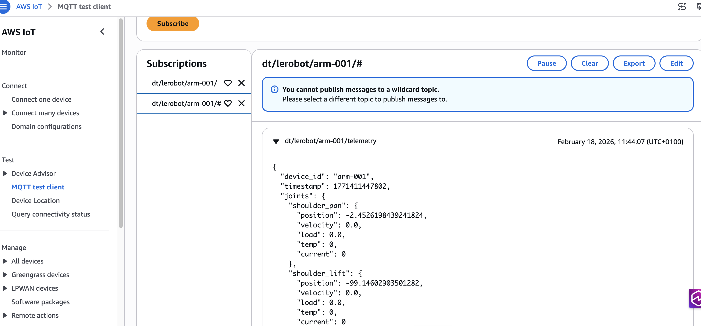

# LeRobot SO-101 AWS IoT Integration

Stream servo sensor data from a LeRobot SO-101 robotic arm to AWS IoT Core via Greengrass v2. The component supports three modes: (1) direct serial access to read servo registers, (2) ROS2 subscriber mode that consumes JointState and DiagnosticArray topics from the lerobot-ros2-teleoperate wrapper, and (3) mock mode for testing without hardware. In ROS2 mode, the component also publishes ROS2 topics for local ecosystem integration.

<p align="center">
  
</p>
<p align="center">
  
</p>

## Prerequisites

- AWS CLI configured with appropriate credentials
- AWS CDK bootstrapped in target region
- Node.js 18+ and npm
- Java 11+ (for Greengrass installer)
- Python 3.12 (for component runtime)
- LeRobot SO-101 arm connected via USB serial (for device setup)
- ROS2 Humble or Jazzy (optional, for local ROS2 topic publishing) — set distro in config.json

## Operating Modes

The component supports three modes (set via `component.mode` in config.json):

1. **serial** - Direct hardware access. Component reads servo registers (position, velocity, load, temp, voltage, current, status, moving) via USB serial at configured polling rate.

2. **ros2** - Subscriber mode. Component subscribes to `/joint_states` and `/servo_diagnostics` ROS2 topics published by the `lerobot-ros2-teleoperate.py` wrapper script. Use this mode when running lerobot teleoperation and you want Greengrass to forward telemetry to AWS IoT Core.

3. **mock** - Testing mode. Component generates synthetic servo data without requiring hardware. Useful for development and integration testing.

### ROS2 Mode Setup

When using `mode: "ros2"`, you must run the wrapper script to publish ROS2 topics:

```bash
python3 scripts/lerobot-ros2-teleoperate.py \
    --robot.type=so101_follower \
    --robot.port=/dev/ttyACM0 \
    --teleop.type=so101_leader \
    --teleop.port=/dev/ttyACM1
```

The wrapper script:
- Monkey-patches lerobot's teleoperation loop
- Publishes JointState messages to `/joint_states` at ~60Hz
- Publishes DiagnosticArray messages to `/servo_diagnostics` at ~10Hz
- Passes all lerobot-teleoperate arguments unchanged

The Greengrass component subscribes to both topics, merges the data, and forwards to AWS IoT Core.

## Configuration

Key fields to configure:
- `iot.deviceId` - Unique identifier for this robot (e.g., "arm-001")
- `component.serialPort` - USB serial port path (e.g., "/dev/ttyACM2")
- `component.mode` - Operating mode: "serial", "ros2", or "mock"
- `ros2.distro` - ROS2 distribution: "humble" or "jazzy"

See [config.json](config.json) for all settings.

## Deployment

### 1. Deploy Cloud Infrastructure

From your development machine:

```bash
cd infra
npm install
npx cdk synth    # Validate templates
npx cdk deploy   # Deploy to AWS
```

Note the CDK outputs (Thing name, policy name, role alias, region, endpoint).

### 2. Provision Device

On the robot host with the SO-101 arm connected:

```bash
sudo -E ./scripts/setup-device.sh
```

This script will:
- Install Greengrass Core v2
- Create IoT Thing certificate and private key
- Attach certificate to IoT Thing
- Configure systemd service
- Deploy the telemetry component

The component will start automatically and begin publishing telemetry.

## Testing

### Check Service Status

```bash
sudo systemctl status greengrass.service
```

### Run Test Script

```bash
./scripts/test-telemetry.sh
```

### Verify in AWS Console

1. Open [AWS IoT Core Test Client](https://console.aws.amazon.com/iot/home#/test)
2. Subscribe to topic: `dt/lerobot/arm-001/telemetry`
3. You should see JSON messages published at 10Hz with servo data

## Architecture

See [docs/architecture.md](docs/architecture.md) for detailed architecture diagrams covering all three operating modes.

## Cleanup

### Remove Device Provisioning

On the robot host:

```bash
sudo ./scripts/teardown-device.sh
```

This will:
- Stop and disable Greengrass service
- Remove Greengrass installation
- Delete certificates and keys

### Destroy Cloud Resources

From your development machine:

```bash
cd infra
npx cdk destroy
```

Note: You may need to manually delete the IoT Thing certificate in the AWS Console if it's still attached.

## Project Structure

```
/infra         CDK stack (TypeScript) - IoT Core, Greengrass, IAM
/component     Greengrass component (Python 3.12)
/scripts       Device provisioning and testing scripts
/plans         Implementation plans
config.json    Project configuration
```

## Troubleshooting

### Component Not Starting

Check Greengrass logs:
```bash
sudo tail -f /greengrass/v2/logs/greengrass.log
```

Check component deployment status:
```bash
sudo /greengrass/v2/bin/greengrass-cli component list
sudo /greengrass/v2/bin/greengrass-cli component details --name com.lerobot.telemetry
```

### View Component Logs

```bash
sudo tail -f /greengrass/v2/logs/com.lerobot.telemetry.log
```

### Verify ROS2 Topics

When running in `serial` mode, the component publishes ROS2 topics directly. When running in `ros2` mode, the wrapper script publishes topics and the component subscribes. From another terminal on the same machine:

```bash
source /opt/ros/jazzy/setup.bash  # or humble, matching your installation

ros2 topic list
# Should show /joint_states and /servo_diagnostics

ros2 topic echo /joint_states
# Should show JointState messages at configured rate

ros2 topic echo /servo_diagnostics
# Should show DiagnosticArray messages with servo temperature/current
```

If topics don't appear, check the component log for ROS2 initialization status:

```bash
sudo grep -i "ros2\|rclpy" /greengrass/v2/logs/com.lerobot.telemetry.log
```

### Serial Port Access Denied

Ensure `ggc_user` is in the `dialout` group:
```bash
sudo usermod -a -G dialout ggc_user
sudo systemctl restart greengrass.service
```

### No Messages in IoT Core

Verify component is publishing:
```bash
sudo grep "Published" /greengrass/v2/logs/com.lerobot.telemetry.log
```

Check IoT Thing policy allows publish to `dt/lerobot/arm-001/*`.

### Mock Mode (No Hardware)

For testing without a physical arm, set `mode: "mock"` in `config.json` before deploying the infrastructure. You can also edit the component configuration in Greengrass deployment to change the mode.

### Example Telemetry Payload

```json
{
  "device_id": "arm-001",
  "timestamp": 1706000000000,
  "joints": {
    "shoulder_pan": {"position": 2048, "velocity": 0, "load": 12, "temp": 35, "voltage": 7.2, "current": 150, "status": 0, "moving": 1},
    "shoulder_lift": {"position": 1800, "velocity": 5, "load": 45, "temp": 38, "voltage": 7.1, "current": 280, "status": 0, "moving": 1},
    "elbow_flex": {"position": 2200, "velocity": 3, "load": 30, "temp": 36, "voltage": 7.3, "current": 200, "status": 0, "moving": 0},
    "wrist_flex": {"position": 2100, "velocity": 0, "load": 8, "temp": 33, "voltage": 7.2, "current": 120, "status": 0, "moving": 0},
    "wrist_roll": {"position": 2048, "velocity": 0, "load": 5, "temp": 32, "voltage": 7.4, "current": 100, "status": 0, "moving": 0},
    "gripper": {"position": 1500, "velocity": 0, "load": 15, "temp": 34, "voltage": 7.2, "current": 160, "status": 0, "moving": 1}
  }
}
```

## References

- [LeRobot Project](https://github.com/huggingface/lerobot)
- [AWS IoT Greengrass v2 Developer Guide](https://docs.aws.amazon.com/greengrass/v2/developerguide/)
- [AWS CDK TypeScript Reference](https://docs.aws.amazon.com/cdk/api/v2/docs/aws-construct-library.html)
